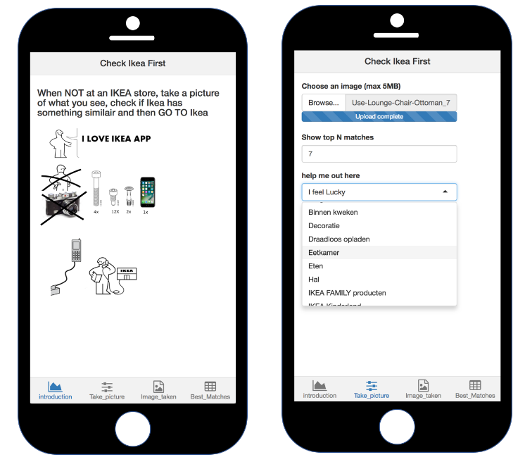
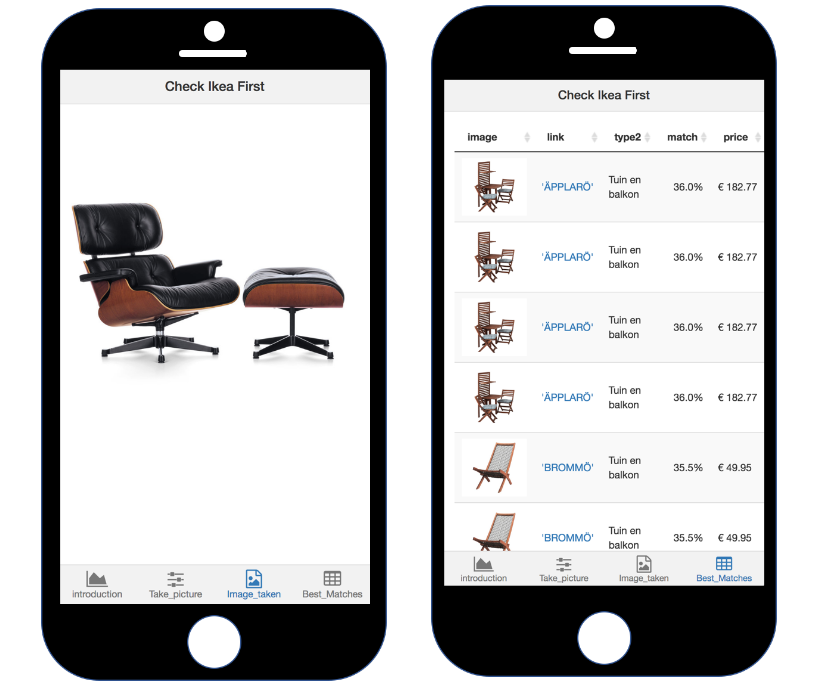

# I_LOVE_IKEA_SHINY_APP

This is [the Ikea hackaton](http://hackathon.ikea.com/) R Shiny app that we (I, Jos van Dongen and Thomas van Dongen) created on December 7,8,9 of 2017. The instructions for the app are quite simple, see images below.

The app helps IKEA customers to look for Ikea products by means of image search. Take a picture, upload it and you will get the top matching IKEA products back.

  

  

So what steps are taken to get this app working?

1. Scrape IKEA website using R package rvest for product images, in total we have around 9000 scraped IKEA images.

2. Use R Keras to put all images through a pretrained VGG16 network from which the top layers are removed. Each image is now a tensor, that we flatten to a vector (25.088 dimensional vector). So we end up with a 9000 by 25088 matrix.

  

3. For a new iamge: put it trough the same network, and flatten this to a 25088 dimensional vector as well. Now determine for that image the top 10 closest IKEA images, using for example cosine similarity.

4. Present the reults in a Shiny App.

